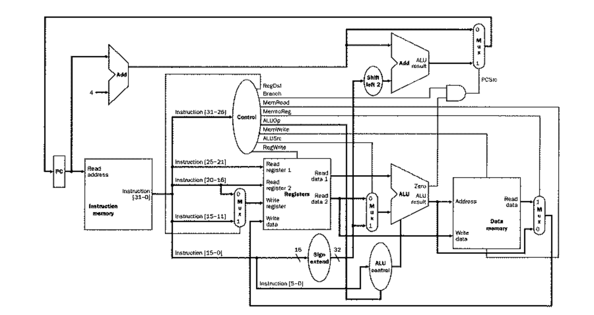

# ECE 251 Final Project - The Cooper Union Spring 2026

# Jayden Chen and Matthew Jeong

## Description

This project implements a 32-bit single-cycle MIPS CPU in SystemVerilog, paired with a custom assembler written in Rust. The CPU follows the MIPS32 instruction set architecture and supports R-type, I-type, and J-type instructions spanning arithmetic, logic, memory access, and control flow. The assembler translates MIPS assembly source files into ASCII hex `.mem` files compatible with Icarus Verilog's `$readmemh` system task.

## CPU Design



The CPU is a single-cycle implementation where every instruction completes in one clock cycle. The datapath connects an instruction memory, register file, ALU, and data memory, all coordinated by a central control unit split into a main decoder (`maindec.sv`) and an ALU decoder (`aludec.sv`). Multiply and divide results are computed on the falling clock edge and stored in a dedicated 64-bit `HiLo` register, with `mfhi` and `mflo` reading the upper and lower halves respectively.

## Supported Instructions

The CPU supports the following subset of the MIPS32 instruction set.

## Instruction Format

- Instruction width: 32 bits
- Immediate width: 16 bits (I-type)
- PC increment: 32 bits (4 bytes per instruction)
- Memory addressable by words (32 bits)

### R-Type

`op[31:26] = 000000` — decoded by the `funct` field

| Instruction | Operation |
|-------------|-----------|
| `add`  | `rd = rs + rt` (signed) |
| `sub`  | `rd = rs - rt` (signed) |
| `and`  | `rd = rs & rt` |
| `or`   | `rd = rs \| rt` |
| `nor`  | `rd = ~(rs \| rt)` |
| `xor`  | `rd = rs ^ rt` |
| `slt`  | `rd = (rs < rt) ? 1 : 0` |
| `sll`  | `rd = rt << shamt` |
| `srl`  | `rd = rt >> shamt` |
| `mult` | `HiLo = rs * rt` (64-bit, clocked) |
| `div`  | `Lo = rs / rt`, `Hi = rs % rt` (clocked) |
| `mflo` | `rd = Lo` |
| `mfhi` | `rd = Hi` |

### I-Type

| Instruction | Opcode | Operation |
|-------------|--------|-----------|
| `addi` | `001000` | `rt = rs + imm` (sign-extended) |
| `lw`   | `100011` | `rt = Mem[rs + imm]` |
| `sw`   | `101011` | `Mem[rs + imm] = rt` |
| `beq`  | `000100` | `if (rs == rt) PC = PC+4 + imm<<2` |

### J-Type

| Instruction | Opcode | Operation |
|-------------|--------|-----------|
| `j` | `000010` | `PC = {PC[31:28], target, 2'b00}` |

## Control Signals

The control unit is split into two modules:

- `maindec.sv` — decodes the 6-bit opcode into the top-level control signals
- `aludec.sv` — decodes `aluop` + `funct` into the 4-bit `alucontrol` signal

Signals generated by the main decoder:

| Signal | Description |
|--------|-------------|
| `regwrite` | Enable write to register file |
| `regdst`   | Select destination register (`rt` vs `rd`) |
| `alusrc`   | Select second ALU operand (register vs sign-extended immediate) |
| `branch`   | Enable branch logic |
| `memwrite` | Enable data memory write |
| `memtoreg` | Route memory output to register file |
| `jump`     | Override PC with jump target |
| `aluop`    | 2-bit hint passed to ALU decoder |

Control signal table by instruction:

| Instruction | regwrite | regdst | alusrc | branch | memwrite | memtoreg | jump | aluop |
|-------------|----------|--------|--------|--------|----------|----------|------|-------|
| R-type      | 1 | 1 | 0 | 0 | 0 | 0 | 0 | 10 |
| `lw`        | 1 | 0 | 1 | 0 | 0 | 1 | 0 | 00 |
| `sw`        | 0 | 0 | 1 | 0 | 1 | 0 | 0 | 00 |
| `beq`       | 0 | 0 | 0 | 1 | 0 | 0 | 0 | 01 |
| `addi`      | 1 | 0 | 1 | 0 | 0 | 0 | 0 | 00 |
| `j`         | 0 | 0 | 0 | 0 | 0 | 0 | 1 | 00 |

## ALU Operations

The ALU is driven by a 4-bit `alucontrol` signal. Multiply and divide are clocked on the negative edge and write to the internal `HiLo` register.

| alucontrol | Operation |
|------------|-----------|
| `0000` | AND |
| `0001` | OR |
| `0010` | ADD |
| `0011` | NOR |
| `0100` | MFLO (read lower 32 bits of HiLo) |
| `0101` | MFHI (read upper 32 bits of HiLo) |
| `0110` | SUB (two's complement) |
| `0111` | SLT (signed less-than) |
| `1000` | MULT (clocked, writes HiLo) |
| `1001` | DIV (clocked, writes HiLo) |
| `1010` | XOR |
| `1011` | SLL |
| `1100` | SRL |

## Register File

- 32 general-purpose 32-bit registers (`$zero` through `$ra`)
- `$zero` (register 0) is hardwired to 0
- Two read ports, one synchronous write port
- Standard MIPS calling conventions apply

| Registers | Names | Purpose |
|-----------|-------|---------|
| `$0` | `$zero` | Always zero |
| `$1` | `$at` | Assembler temporary |
| `$2–$3` | `$v0–$v1` | Function return values |
| `$4–$7` | `$a0–$a3` | Function arguments |
| `$8–$15` | `$t0–$t7` | Caller-saved temporaries |
| `$16–$23` | `$s0–$s7` | Callee-saved |
| `$24–$25` | `$t8–$t9` | More temporaries |
| `$26–$27` | `$k0–$k1` | OS reserved |
| `$28` | `$gp` | Global pointer |
| `$29` | `$sp` | Stack pointer |
| `$30` | `$fp` | Frame pointer |
| `$31` | `$ra` | Return address |

## Assembler

The assembler is written in Rust and lives in the `tools/mips_32_assembler/` subdirectory. It is a two-pass assembler:

- **Pass 1** — scans the source to assign addresses to all labels
- **Pass 2** — encodes every instruction to its 32-bit machine code representation, resolving label references for branches and jumps

Running the assembler within the subdirectory:

```bash
cargo run -- input.asm output_name
```

If arguments are omitted the assembler prompts interactively:

```
Input file: program.asm
Output name (without extension): program
```

### Assembler Source Files

| File | Purpose |
|------|---------|
| `src/main.rs` | Entry point, CLI prompts, file I/O |
| `src/lexer.rs` | Tokenises the `.asm` source file |
| `src/parser.rs` | Builds an AST from the token stream |
| `src/emitter.rs` | Two-pass encoder, produces machine code |
| `src/memfile.rs` | Writes `.mem` output files |
| `src/error.rs` | Error types with line-number reporting |

### Supported Pseudo-Instructions

| Pseudo | Expands To |
|--------|-----------|
| `nop` | `sll $zero, $zero, 0` |
| `move $rd, $rs` | `addu $rd, $zero, $rs` |
| `li $rt, imm` | `addiu $rt, $zero, imm` (or `lui`+`ori` if > 16 bits) |
| `la $rt, label` | `lui $rt, upper` + `ori $rt, $rt, lower` |
| `beqz $rs, label` | `beq $rs, $zero, label` |
| `bnez $rs, label` | `bne $rs, $zero, label` |
| `not $rd, $rs` | `nor $rd, $rs, $zero` |
| `neg $rd, $rs` | `sub $rd, $zero, $rs` |

## Memory Format

The assembler outputs ASCII hexadecimal `.mem` files loadable with `$readmemh`. Each line contains one 32-bit word in big-endian byte order.

For a program with a `.data` section, two files are produced:

- `program.mem` — instruction memory (one word per line)
- `program_data.mem` — data memory (data bytes packed into big-endian words)

Example `program.mem`:

```
20080005
20090003
01095020
0000000c
```

Loading in SystemVerilog:

```systemverilog
logic [31:0] imem [0:255];
logic [31:0] dmem [0:255];

initial begin
    $readmemh("program.mem",      imem);
    $readmemh("program_data.mem", dmem);
end

// Instruction fetch (word-addressed)
assign instruction = imem[pc >> 2];

// Data memory access
localparam DATA_BASE = 32'h10010000;
assign read_data = dmem[(alu_result - DATA_BASE) >> 2];
```

### Instruction Memory (IMEM)

- Provides 32-bit instructions to the datapath based on the PC
- Preloaded at simulation start via `$readmemh`
- Read-only during execution

### Data Memory (DMEM)

- Used for `lw` and `sw` operations
- 32-bit wide, word-addressable in this implementation
- Write controlled by `memwrite`; read routed to register file by `memtoreg`
